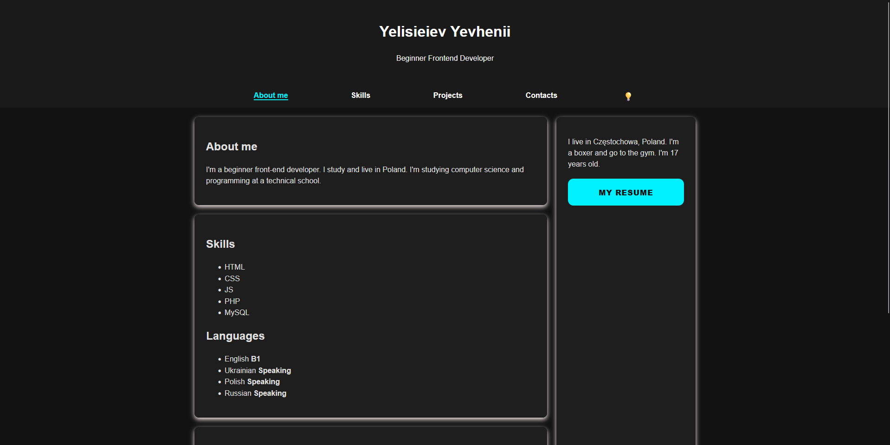
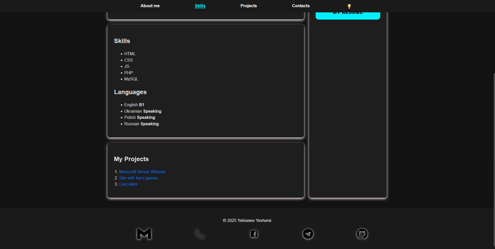
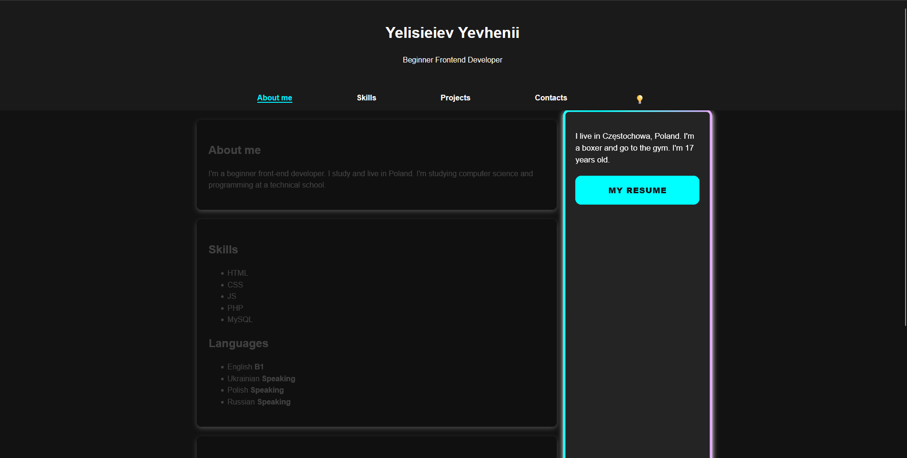
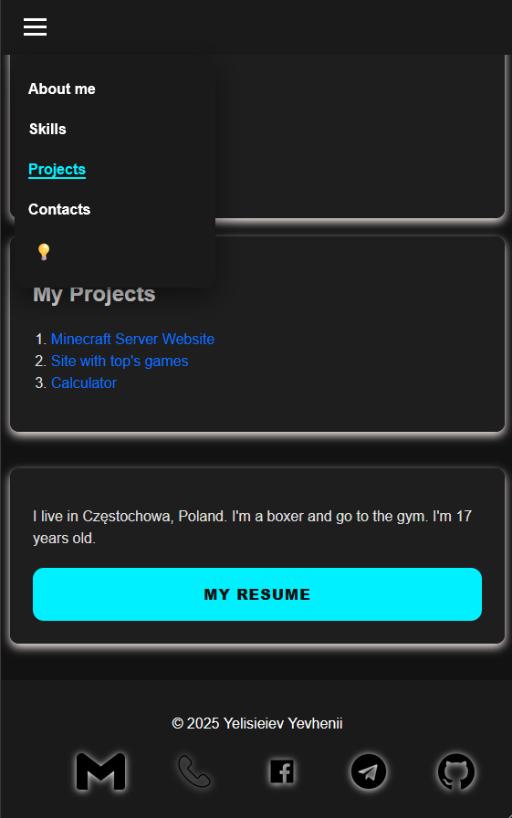
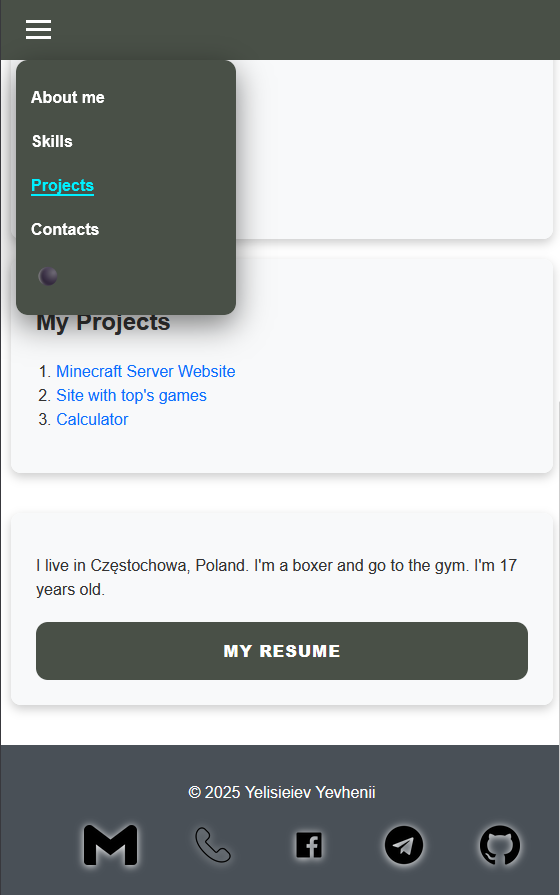

# Frontend Developer Portfolio 🥊

Hi! I'm **Yevhenii Yelisieiev**, a passionate beginner Frontend Developer based in Częstochowa, Poland. I am currently studying Computer Science and Programming, focusing on building clean, responsive, and user-friendly web applications.

## 🚀 About the Project
This repository hosts my personal portfolio website. It showcases my skills, current projects, and contact information. This project served as a great way to practice modern CSS techniques and DOM manipulation.

### Key Features:
* **Fully Responsive:** Optimized for desktops, tablets, and smartphones.
* **Smart Mobile Navigation:** A custom-built navigation bar that "swipes" away on scroll and transforms into a functional burger menu.
* **Persistent Dark Mode:** Users can toggle between light and dark themes, with their preference saved in `localStorage`.
* **Interactive UI:** Animated gradient borders, hover effects, and smooth transitions.
* **Performance Optimized:** Clean code structure with efficient event handling to prevent lag during animations.
* **Custom 404 Page:** A branded error page to guide lost users back home.

## 🛠 Tech Stack

* **HTML5:** Semantic structure for better SEO and accessibility.
* **CSS3:** Flexbox, CSS Variables, Keyframe Animations, and Media Queries.
* **JavaScript:** Intersection Observer API for active links, event bubbling control, and theme logic.

## 🔗 Live Demo
Check out the live version of my portfolio here:
👉 **[VIEW LIVE PROJECT](https://mpmotorobot.github.io/)**

## 📬 Contact Me
I'm always open to discussing new projects, creative ideas, or opportunities in the tech world.

* **Telegram:** [@MPM227](https://t.me/MPM227)
* **GitHub:** [MPMotorobot](https://github.com/MPMotorobot)
* **Email:** mpmotorobot0@gmail.com

## 📄 License
This project is open-source and free to use for learning purposes.
---
## 📸 Screenshots

### Desktop Version

### Mobile Version

  
  

---
*Created with ❤️ by Yevhenii Yelisieiev — 2025*